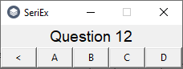
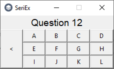

# SerialExaminer
  SerialExaminer is a small tool to speed up test evaluation and detection of potential fraudsters. It's easy to use and works quickly with lots of files

  Ask your students to send you test responses in .txt files named after their full names, journal number, any ID numbers or anything else, that can identify them. Ask them to write answers in these files in format `<question number>.<question answer>`, line by line. The order of questions and letter size don't matter

#### Table of Contents
  - [Installation](https://github.com/Pixel48/SerialExaminer#installation)
    - [Windows](https://github.com/Pixel48/SerialExaminer#windows)
    - [Linux](https://github.com/Pixel48/SerialExaminer#linux)
  - [Usage](https://github.com/Pixel48/SerialExaminer#usage)
    - [Generating an exam key](https://github.com/Pixel48/SerialExaminer#generating-an-exam-key)
    - [Importing an exam key](https://github.com/Pixel48/SerialExaminer#importing-an-exam-key)
    - [Checking tests](https://github.com/Pixel48/SerialExaminer#checking-tests)
    - [Searching for cheaters](https://github.com/Pixel48/SerialExaminer#searching-for-cheaters)
  - [Limits](https://github.com/Pixel48/SerialExaminer#limits)
    - [Answers in exam key](https://github.com/Pixel48/SerialExaminer#answers-in-exam-key)
    - [Records in result display](https://github.com/Pixel48/SerialExaminer#records-in-result-display)

## Installation
  Download the latest [SerialExaminer installer](https://github.com/Pixel48/SerialExaminer/releases/latest)

  `SerialExaminerSetup.exe` is 32-bit. For 64-bit systems, download `SerialExaminerSetup-x64.exe`
  > For now, downloading the installer will launch [UAC](https://en.wikipedia.org/wiki/User_Account_Control) *Unknown publisher* alert because it is not digitally signed - For now I can't afford digital certification

## Usage
  How to use SerialExaminer interface

  

### Generating an exam key
  1. Provide the exact number of questions and answers in the exam and Press `Create key!` button

  

  2. Provide answers to questions about the given number. If you make a mistake you can go back using the `<` button. Window will disappear automatically after entering the last answer

  

  3. After key answer window vanish, press `Done` button and provide where to save exam key for potential future use. (You dont need to import key after creating it, it's imported immediately after save).

### Checking tests
  1. Create or import correct exam key
  2. Press `Browse` button and provide folder with files written by your students
  3. Press `Check` button to calculate results
  4. Press `Display` button to show test results
  5. Press `Export` button, if you want to generate report file with result table in selected format

  
  > Future updates will add export options and `predicted grade` column in results

### Searching for cheaters
  1. Press `Import` button
  2. In new dialog change file extension to ***Plain text (\*.txt)***
  3. Select the source file to which you want to check the similarity in other tests
  4. Press `Browse` button and provide folder with other tests
  5. Press `Check` button to calculate results
  6. Press `Display` button to show similarity of other tests to source test

## Limits
  SerialExaminer limitation list for [last release](https://github.com/Pixel48/SerialExaminer/releases/latest).

  *These limits will be removed by future updates.*

### Answers in exam key
  Key creator supports answers quantity in range from 4 to 12

  
  

### Records in result display
  Test result display windows supports up to 240

  

###### Copyright (c) 2020 [Pixel48](https://github.com/Pixel48/) All Rights Reserved
