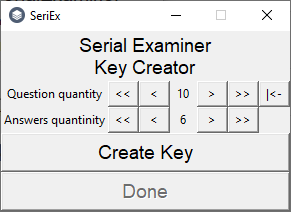

# SerialExaminer
SerialExaminer is a small multitool to speed up assessing tests and detecting potential fraudsters. It's easy to use, fast to use and will be long developed and improved

## Table of Contents
- [What is it?](https://github.com/Pixel48/SerialExaminer#serialexaminer)
- [How to get it?](https://github.com/Pixel48/SerialExaminer#run)
- [How to use it?](https://github.com/Pixel48/SerialExaminer#usage)
  - [...on Windows](https://github.com/Pixel48/SerialExaminer#windows)
  - [...on Linux](https://github.com/Pixel48/SerialExaminer#linux)

## Installation
### Windows
Download application installer from [last release](https://github.com/Pixel48/SerialExaminer/releases/latest), install it and run using fresh desktop shortcut
> For now every installer will trigger [UAC](https://en.wikipedia.org/wiki/User_Account_Control), because it's not digitally signed, because I'm just a student developing a small project and (for now) I can't afford digital certification

### Linux
***For now in SerialExaminer there's no support for Linux***

Until package for SerialExaminer will be ready with one of future releases, please use source code
```
git clone https://github.com/Pixel48/SerialExaminer.git
python3 SerialExaminer.py
```

To update it use `git fetch` in *SerialExaminer* folder
> Actually you should know that, if you use Linux...

## Usage
1. Ask your students to send you test responses in .txt files named after their full names, journal number, any ID numbers or anything else, that can identify them. Aks them to write answers in these files in format <question number>.<correct answer>, line by line. The order of questions and letter size don't matter.


2. Run SerialExaminer from desktop shortcut and create or import exam key file (\*.exkey).
   - If you create exam key file...
     - Provide the exact number of questions and answers in the exam and hit `Create key!` button

     
     > Now the key creator supports the number of answers from 4 to 12, future updates will gradually expand this range until they finally remove this restriction

     - Provide answers to questions about the given number. If you make a mistake you can go back using the `<` button. Window will disappear automatically after entering the last answer

     

     - After key answer window vanish, hit `Done` button and provide where to save exam key for potential future use. (You dont need to import key after creating it, it's imported immediately after save).
   - If you already had created exam key file...
3. Hit `Browse` button and provide folder with files from step 1.
4. Hit `Check!` button to calculate results


> Future updates will automate this process and remove this button

5. Use `Display` button to show test results


> Future updates will add export options and `predicted grade` column in results

Copyright (c) 2020 [Pixel48](https://github.com/Pixel48/) All Rights Reserved.
