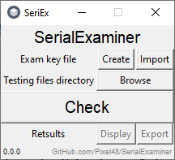

# SerialExaminer
> To make my teachers life bit easier
>>(... and proof them that even the strangest students can somehow help :)

## Table of Contents
- [Why would you use it?](https://github.com/Pixel48/SerialExaminer#why-would-you-use-it)
- [How tu use it?](https://github.com/Pixel48/SerialExaminer#usage)
- [How to run it?](https://github.com/Pixel48/SerialExaminer#run)
  - [...on Windows](https://github.com/Pixel48/SerialExaminer#windows)
  - [...on Linux](https://github.com/Pixel48/SerialExaminer#linux)
- [Developer's tasklist](https://github.com/Pixel48/SerialExaminer#tasklist)

## Why would you use it?
Good question! An maybe that's why this section is titled like that...

If you are teacher, or you just have to check several files with answers to some kind of test or exam with a lot of questions and specified answers - that would be something you might be interested!

### Where's the problem
Of course, you can take some time to correct these answers, but if you teach, for example, 5 classes with 30 students in class, and in every class you'll make test with 40 questions, **you'll have to compare 6000 checkboxes with exam key, _manually_**...

### Found problem, create a solution!
Let's suppose that your students can use computers to make .txt file with answers to test from .pdf file with questions, and then give it to you via pendrive after 15 minutes, and you now can select this pendrive in come kind of program, and in a snap get marks for these students!

***This is this software***

## Usage
1. Ask your students to send you test responses in .txt files named after their full names, journal number, any ID numbers or anything else, that can identify them. Aks them to write answers in these files in format <question number>.<correct answer>, line by line. The order of questions and letter size don't matter.

2. Run SerialExaminer and create or import exam key file (\*.exkey).
   - If you create exam key...
     - Provide the exact number of questions and answers in the exam and hit `Create key!` button

     
     > Now the key creator supports the number of answers from 4 to 12, future updates will gradually expand this range until they finally remove this restriction

     - Provide answers to questions about the given number. If you make a mistake you can go back using the `<` button. Window will disappear automatically after entering the last answer

     

     - After key answer window vanish, hit `Done` button and provide where to save exam key for potential future use. (You dont need to import key after creating it, it's imported immediately after save).
3. Hit `Browse` button and provide folder with files from step 1.
4. Hit `Check!` button to calculate results

> Future updates will automate this process and remove this button

5. Use `Display` button to show test results

> Future updates will add export options and `predicted grade` column in results

## Launching
There's several ways to launch SerialExaminer

#### Windows
1. Download all project files and compile it to \*.exe file with [pyinstaller](https://www.pyinstaller.org/)
- Download project folder
- Download the newest version of python from [here](https://www.python.org/downloads/)
- Follow first two steps from way one
- Run `pip3 install pyinstaller==3.4` in CMD
- Run `pyinstaller -w -F -i ico.ico SerialExaminer.py` in CMD at project folder
- Take completed SerialExaminer.exe file from dist/ folder
2. Download all project files and launch SerialExaminer.py with [Python3](https://www.python.org/)
- Download project folder
- Download the newest version of python from [here](https://www.python.org/downloads/)
- Add python to your [PATH](https://superuser.com/questions/143119/how-do-i-add-python-to-the-windows-path)
- Run `python ./SerialExaminer.py` in CMD at project folder

#### Linux
Just `git clone https://github.com/Pixel48/SerialExaminer.git` and use python. Or use pyinstaller to make it binary. It's Linux

## Tasklist
- [x] Basic GUI
- [x] Key create (\*.exkey)
- [x] Basic key create interface
- [x] Set custom questions quantity
- [x] Set custom answers quantity
- [ ] Key import from selected file in
- [x] ... \*.exkey format
- [ ] ... \*.txt format
- [ ] ... \*.xml format
- [ ] Import test files from provided directory in selected format
- [x] ... \*.txt
- [ ] ... \*.csv
- [ ] ... \*.xml
- [ ] Automate importing and examining process
- [x] Test test files with imported/created key
- [ ] Cheater finder
- [x] Display test results
- [ ] ... `predicted grade` column in results
- [ ] Export test results to selected file in
- [ ] ... \*.csv format
- [ ] ... \*.xml format
- [ ] ... \*.txt format
- [x] Release basic aplha
- [x] ~~Send it to my highschool teachers~~ (I fu**ed it up)
- [ ] Give it to somebody who will actually use it
- [ ] Make it usable and useful
- [ ] Add autoupdate faeture from [SerialExaminer](https://github.com/Pixel48/SerialExaminer) repository

Copyright (c) 2020 [Pixel48](https://github.com/Pixel48/) All Rights Reserved.
